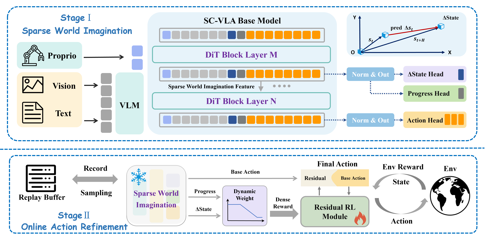

# 🤖 Self-Correcting VLA: Online Action Refinement via Sparse World Imagination

<div align="center">
  
</div>

> 📜 [[paper](https://arxiv.org/abs/2602.21633)] 🤗 [[datasets](https://huggingface.co/datasets/Kisaragi0/arx5_real_world_datasets)]

## 🚀 News
- (🔥 New) **(2025.2.8)** We have released the code and datasets of SC-VLA !
- (🔥 New) **(2025.2.8)** Our paper is released on the arXiv.

## Preparation
Here we provide a conda environment setup for the project.
```shell
# clone the repository
git clone https://github.com/Kisaragi0/SC-VLA.git
cd SC-VLA

conda create -n scvla python=3.10
conda activate scvla

# install dependencies
pip install --upgrade setuptools
pip install -r requirements.txt

# Install ffmpeg (required only for torchcodec(real-bot))
conda install -c conda-forge ffmpeg==7.1.1
```

FlashAttention is required for efficient attention computation. The version must be compatible with your CUDA and PyTorch installation.
```shell
pip install --no-build-isolation flash-attn==2.7.1.post4
```
**Hardware Note:**  
We have validated the project on NVIDIA **L40 (CUDA 12.4)** and **RTX 5090 (CUDA 12.8)** GPUs.  
Please make sure to install compatible versions of PyTorch, xFormers, and FlashAttention according to your CUDA version.

> Download the pretrained [GR00T N1.5](https://huggingface.co/nvidia/GR00T-N1.5-3B) weights from Huggingface and save them in `SC-VLA/GR00T-N1.5-3B/`

## Datasets
### 1. Simulation Data (ManiSkill)
All simulation-based datasets and experiments in this project are conducted using the ManiSkill environment.

The [ManiSkill](https://github.com/haosulab/ManiSkill) simulation environment should be set up following the official installation guide.

We recommend installing ManiSkill in a separate conda environment (e.g., `maniskill`) following the official guide.

### 2. Real-World Robot Data
We provide real-world robot datasets collected on the ARX-5 platform via HuggingFace.

You can download the dataset using the HuggingFace CLI:
```bash
huggingface-cli download Kisaragi0/arx5_real_world_datasets \
  --repo-type dataset \
  --local-dir arx5_real_world_datasets
```

## Training
### 0.Environment Overview

| Component | Conda Environment | Description |
|---------|-------------------|-------------|
| SC-VLA Server | `scvla` | Model loading, policy inference, and training |
| ManiSkill Client | `maniskill` | Simulation, interaction, and evaluation |

> modify the variables in the script before you execute the following instruction
### 1. Train Sparse World Imagination Model
```shell
python scripts/scvla_train.py
# In the action head implementation:gr00t/model/action_head/flow_matching_action_head.py
# Make sure dataset and STATS_PATH are set consistently across the two files.
```
### 2. Train Online Action Refinement Model
```shell
# Ensure that the host and port settings are consistent between the policy service and the ManiSkill environment.
# Start the policy inference service (SC-VLA Environment)
python scripts/inference_service_policy.py
# Start training  (ManiSkill Environment)
python sac_residual/sac_maniskill_train.py
```

## Evaluation
### 1. ManiSkill Simulation Evaluation
The evaluation is deployed in a **client–server architecture**, where the policy model runs as a service and the ManiSkill environment interacts with it as a client. To evaluate the model on **ManiSkill**, follow the steps below.

#### Step 1: Launch the Policy Service (SC-VLA Environment)
Before execution, modify the required variables in the script as needed.

```bash
# Start the policy inference service
python scripts/inference_service_policy.py
```
#### Step 2: Launch the ManiSkill Client (ManiSkill Environment)
In a separate terminal, start the ManiSkill client to connect to the policy service.
```bash
# Start the ManiSkill client
python scripts/eval_for_maniskill_v5_client.py
```
The policy service and ManiSkill client must use the same host and port to establish a successful connection.

### 2. ARX5 Real-Robot Deployment
We deploy SC-VLA on the ARX5 real robot platform. The environment setup and data collection follow our existing ARX5 pipeline; please refer to the **[ARX5](https://github.com/buduz/Realbot/tree/main)** repository for details.

The real-robot deployment script for SC-VLA is provided below:
```bash
# Start the ARX5 client
python scripts/deploy_for_arx5_scvla.py
```

## Acknowledgement
Our work is built upon the following projects, Thanks for their great open-source work!
- [Isaac GR00T](https://github.com/NVIDIA/Isaac-GR00T)
- [Policy Decorator](https://github.com/tongzhoumu/policy_decorator)
- [ManiSkill](https://github.com/haosulab/ManiSkill)
- [LeRobot](https://github.com/huggingface/lerobot)

## Citation
If you find this project useful, please consider citing our work:
```bibtex
@misc{liu2026selfcorrectingvlaonlineaction,
      title={Self-Correcting VLA: Online Action Refinement via Sparse World Imagination}, 
      author={Chenyv Liu and Wentao Tan and Lei Zhu and Fengling Li and Jingjing Li and Guoli Yang and Heng Tao Shen},
      year={2026},
      eprint={2602.21633},
      archivePrefix={arXiv},
      primaryClass={cs.RO},
      url={https://arxiv.org/abs/2602.21633}, 
}
```